# CLAUDE.md - Memoria del Sistema React Search Blogs

**Documentación Técnica Completa para IA y Desarrollo**
**Proyecto:** React Search Blogs - Sistema de Búsqueda y Filtrado de Posts
**Versión:** 2.0
**Última actualización:** 2025-01-10

---

## 📋 Índice

1. [Resumen Ejecutivo](#resumen-ejecutivo)
2. [Diagrama de Arquitectura General](#diagrama-de-arquitectura-general)
3. [Diagrama de Flujo de Datos](#diagrama-de-flujo-de-datos)
4. [Diagrama de Estados Redux](#diagrama-de-estados-redux)
5. [Diagrama de Componentes](#diagrama-de-componentes)
6. [Diagrama de Hooks y Lógica](#diagrama-de-hooks-y-lógica)
7. [Diagrama de Despliegue](#diagrama-de-despliegue)
8. [Estructura de Datos](#estructura-de-datos)
9. [Patrones de Diseño](#patrones-de-diseño)
10. [Stack Tecnológico](#stack-tecnológico)
11. [Guía de Desarrollo](#guía-de-desarrollo)
12. [Recomendaciones y Mejoras](#recomendaciones-y-mejoras)

---

## 1. Resumen Ejecutivo

### Descripción General

**React Search Blogs** es una Single Page Application (SPA) desarrollada en React 19 que implementa un sistema sofisticado de búsqueda, filtrado y visualización de posts de blog. La aplicación se integra con el CMS Drupal 10 como backend y utiliza Web Components (Lit) para la UI.

### Características Principales

- **Multi-Layout System**: 4 tipos de página diferentes (búsqueda, tema, autor, lista de autores)
- **Estado Persistente**: Sincronización Redux ↔ URL ↔ localStorage
- **Multilingüe Avanzado**: Cambio de idioma con preservación de filtros y traducción automática
- **Sistema de Prioridades**: Lógica inteligente de carga según el contexto de entrada
- **UX Profesional**: Skeleton loading, manejo de errores, feedback visual
- **Performance Optimizada**: Memoization, lazy loading, optimización de renders

### Propósito del Sistema

Permitir a los usuarios:
1. Buscar posts por término de búsqueda
2. Filtrar por países, temas y tipos de artículo
3. Navegar por paginación
4. Ver posts de un tema específico
5. Ver posts de un autor específico
6. Ver lista completa de autores
7. Compartir búsquedas mediante URLs
8. Mantener filtros entre sesiones
9. Cambiar de idioma preservando filtros

### Arquitectura de Alto Nivel

```
┌──────────────────────────────────────────────────────────────┐
│                      DRUPAL 10 CMS                           │
│  - REST APIs (/api/v1/blogs, /authors, /publications)       │
│  - Gestión de contenido                                      │
│  - Configuración inicial (data-default-props)                │
└────────────────────────┬─────────────────────────────────────┘
                         │ JSON/REST
                         ▼
┌──────────────────────────────────────────────────────────────┐
│                   REACT SPA (v19.1.1)                        │
│  ┌────────────────────────────────────────────────────────┐ │
│  │  Presentation Layer (Components + Lit Web Components) │ │
│  └──────────────────────┬─────────────────────────────────┘ │
│  ┌──────────────────────┴─────────────────────────────────┐ │
│  │  Logic Layer (Custom Hooks + Containers)              │ │
│  └──────────────────────┬─────────────────────────────────┘ │
│  ┌──────────────────────┴─────────────────────────────────┐ │
│  │  State Layer (Redux Toolkit + nuqs + localStorage)    │ │
│  └──────────────────────┬─────────────────────────────────┘ │
│  ┌──────────────────────┴─────────────────────────────────┐ │
│  │  Data Layer (Axios + API Paths)                       │ │
│  └────────────────────────────────────────────────────────┘ │
└──────────────────────────────────────────────────────────────┘
```

### Tecnologías Core

- **React 19.1.1** - Framework UI
- **Redux Toolkit 2.8.2** - Estado global
- **Vite 7.1.5** - Build tool
- **Lit 3.3.1** - Web Components
- **nuqs 2.4.3** - URL state management
- **Axios 1.12.2** - HTTP client

---

## 2. Diagrama de Arquitectura General

### 2.1 Arquitectura en Capas

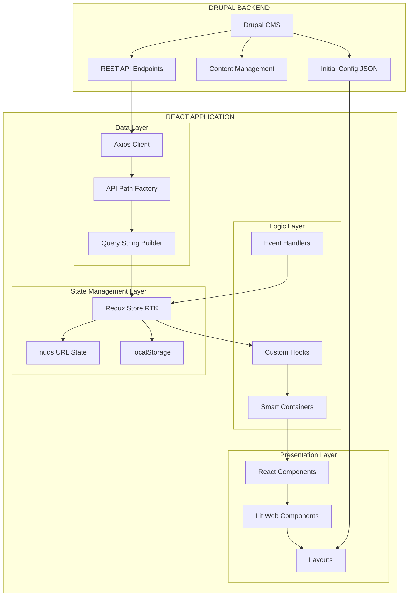

### 2.2 Arquitectura de Fuente de Verdad

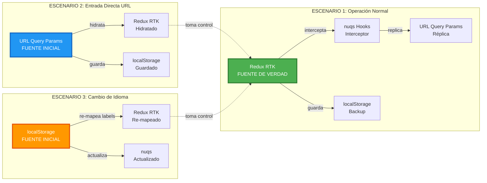

**Descripción:**

- **Redux (RTK)**: Es la fuente de verdad durante la operación normal de la aplicación
- **URL (nuqs)**: Intercepta cambios en Redux y los replica automáticamente. Es fuente inicial solo en entrada directa
- **localStorage**: Persiste estado entre sesiones. Es fuente inicial solo en cambio de idioma

### 2.3 Estructura del Proyecto

```mermaid
graph TD
    ROOT[react_search_blogs/]

    ROOT --> SRC[src/]
    ROOT --> DIST[dist/]
    ROOT --> CONFIG[config files]

    SRC --> API[api/]
    SRC --> SLICES[slices/]
    SRC --> HOOKS[hooks/]
    SRC --> COMPONENTS[components/]
    SRC --> CONTAINERS[containers/]
    SRC --> LAYOUTS[layouts/]
    SRC --> ROUTES[routes/]
    SRC --> HELPERS[helpers/]
    SRC --> UTILS[utils/]
    SRC --> REDUCERS[reducers/]
    SRC --> MAIN[main.jsx]

    API --> API1[index.js]
    API --> API2[paths.js]

    SLICES --> S1[settings/]
    SLICES --> S2[filters/]
    SLICES --> S3[blogs/]
    SLICES --> S4[authors/]
    SLICES --> S5[publications/]

    HOOKS --> H1[useFilterControls.js]
    HOOKS --> H2[useFiltersQuery.jsx]
    HOOKS --> H3[usePaginationQuery.jsx]
    HOOKS --> H4[useSearchQuery.jsx]
    HOOKS --> H5[useLocalStorageFilters.js]
    HOOKS --> H6[useLanguageLinkSync.js]

    COMPONENTS --> C1[posts/]
    COMPONENTS --> C2[filters/]
    COMPONENTS --> C3[authors/]
    COMPONENTS --> C4[banners/]
    COMPONENTS --> C5[pager/]

    LAYOUTS --> L1[MainLayout.jsx]
    LAYOUTS --> L2[SearchBlogsLayout.jsx]
    LAYOUTS --> L3[TopicBlogsLayout.jsx]
    LAYOUTS --> L4[SingleAuthorLayout.jsx]
    LAYOUTS --> L5[AuthorListLayout.jsx]

    CONFIG --> CF1[vite.config.js]
    CONFIG --> CF2[package.json]

    style H1 fill:#FF6B6B,stroke:#C92A2A,stroke-width:2px
    style S1 fill:#4ECDC4,stroke:#2C7873,stroke-width:2px
    style L1 fill:#95E1D3,stroke:#38A89D,stroke-width:2px
```

---

## 3. Diagrama de Flujo de Datos

### 3.1 Flujo Completo: Usuario Aplica Filtro

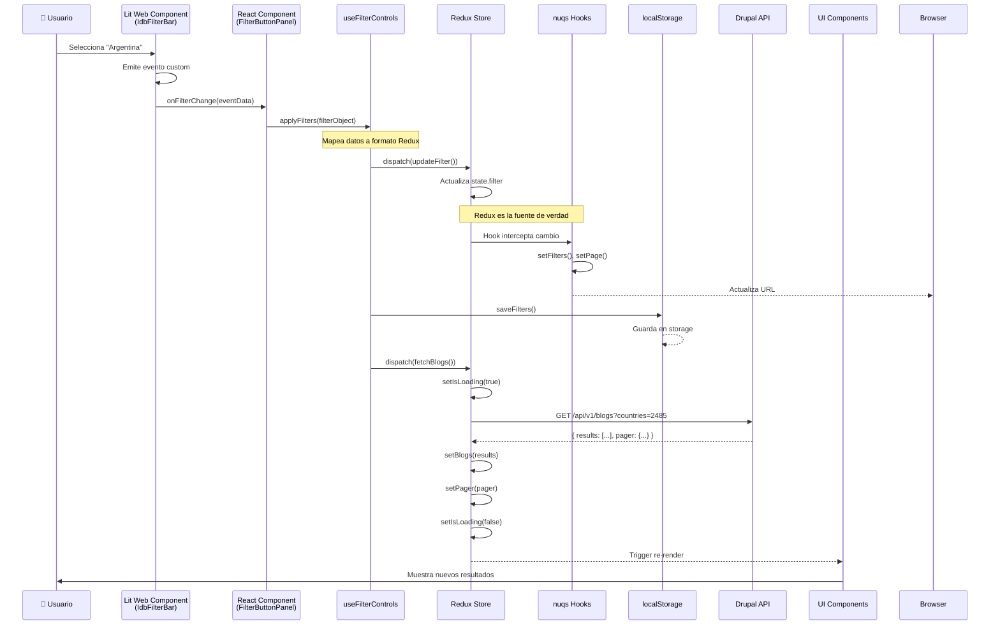

### 3.2 Flujo de Inicialización de la Aplicación

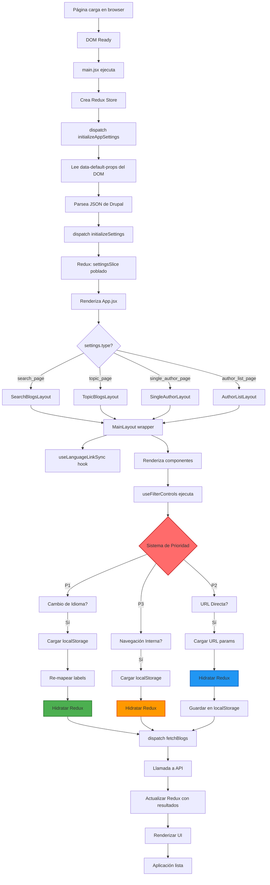

### 3.3 Transformación de Datos en Cada Etapa

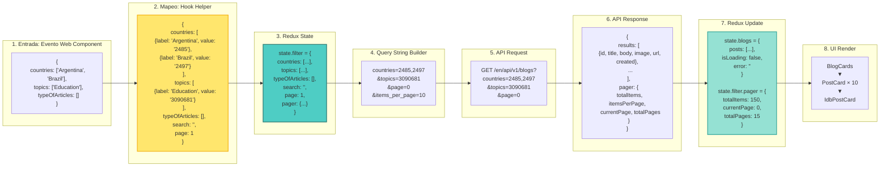

---

## 4. Diagrama de Estados Redux

### 4.1 Redux Store Structure

```mermaid
graph TD
    Store[Redux Store]

    Store --> Settings[settingsSlice]
    Store --> Filters[filterSlice]
    Store --> Blogs[blogsSlice]
    Store --> Authors[authorsSlice]
    Store --> Publications[publicationsSlice]

    Settings --> S1["language: 'en'"]
    Settings --> S2["type: 'search_page'"]
    Settings --> S3["disable_filters: false"]
    Settings --> S4["filter_options: { sections: [...] }"]
    Settings --> S5["menu: { btn_filters, btn_clear }"]
    Settings --> S6["heading: { title, body, image }"]
    Settings --> S7["authorId: 540223"]
    Settings --> S8["main_topic: { label, value }"]

    Filters --> F1["search: ''"]
    Filters --> F2["countries: []"]
    Filters --> F3["topics: []"]
    Filters --> F4["typeOfArticles: []"]
    Filters --> F5["page: 1"]
    Filters --> F6["pager: { totalItems, currentPage, ... }"]
    Filters --> F7["isFilterLoading: false"]

    Blogs --> B1["posts: []"]
    Blogs --> B2["isLoading: true"]
    Blogs --> B3["error: ''"]

    Authors --> A1["list: []"]
    Authors --> A2["isLoading: false"]
    Authors --> A3["error: null"]

    Publications --> P1["list: []"]
    Publications --> P2["isLoading: false"]
    Publications --> P3["error: null"]

    style Settings fill:#4CAF50,stroke:#2E7D32,stroke-width:2px
    style Filters fill:#2196F3,stroke:#1565C0,stroke-width:2px
    style Blogs fill:#FF9800,stroke:#E65100,stroke-width:2px
    style Authors fill:#9C27B0,stroke:#6A1B9A,stroke-width:2px
    style Publications fill:#F44336,stroke:#C62828,stroke-width:2px
```

### 4.2 Flujo de Acciones Redux (filterSlice)

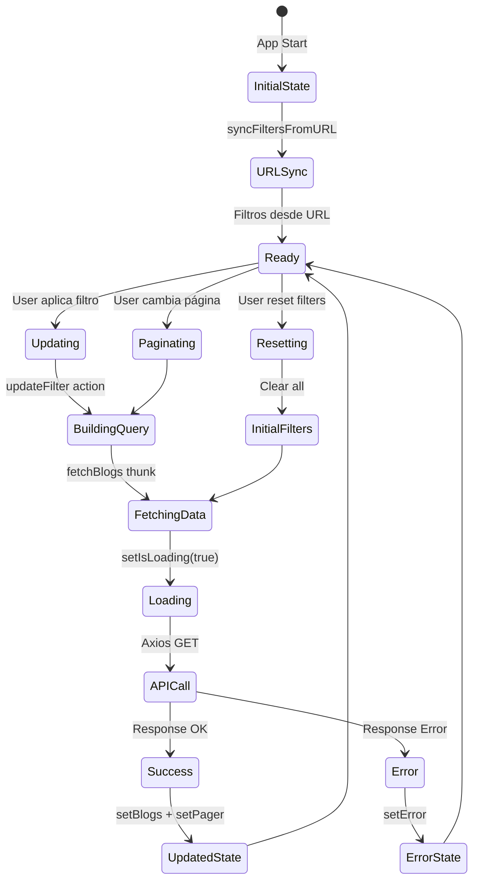

### 4.3 Selectors y Computed Values

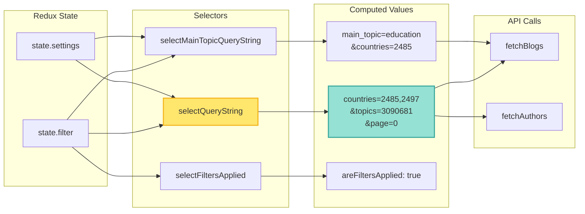

---

## 5. Diagrama de Componentes

### 5.1 Jerarquía de Componentes

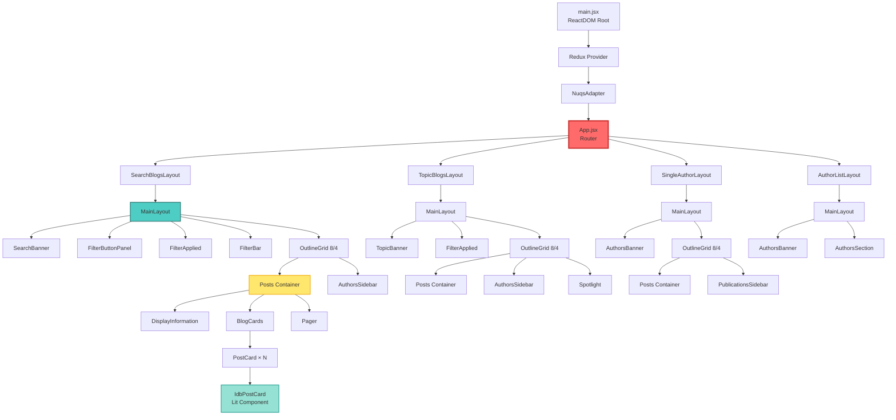

### 5.2 Componentes Presentacionales vs Containers

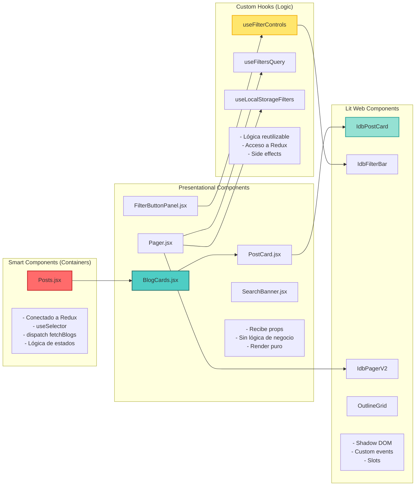

### 5.3 Integración React ↔ Lit

```mermaid
graph TD
    subgraph "React World"
        RC[React Component<br/>FilterButtonPanel.jsx]
        Wrapper[createComponent<br/>@lit/react]
    end

    subgraph "Lit World"
        WC[Web Component<br/>idb-filter-bar]
        Shadow[Shadow DOM<br/>Encapsulated Styles]
    end

    subgraph "Communication"
        Props[Props<br/>filterType, sections, etc.]
        Events[Custom Events<br/>onFilterChange, onFilterReset]
        Slots[Slots<br/>Named content projection]
    end

    RC --> Wrapper
    Wrapper -->|wraps| WC
    WC --> Shadow

    RC -->|pass| Props
    Props --> WC

    WC -->|emit| Events
    Events --> RC

    RC -->|inject| Slots
    Slots --> WC

    style Wrapper fill:#FFE66D,stroke:#F4B41A,stroke-width:3px
    style Events fill:#FF6B6B,stroke:#C92A2A,stroke-width:2px
```

---

## 6. Diagrama de Hooks y Lógica

### 6.1 useFilterControls - Hook Central

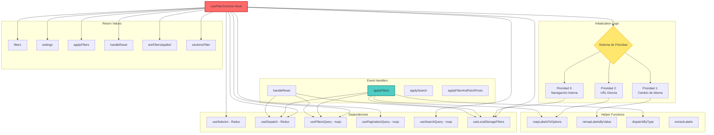

### 6.2 Sistema de Prioridad de Carga

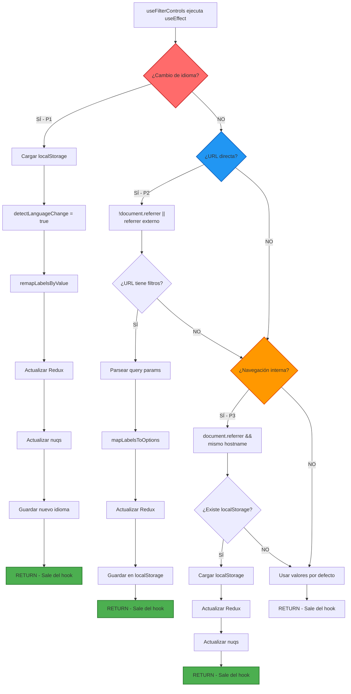

### 6.3 Hooks de Sincronización URL (nuqs)

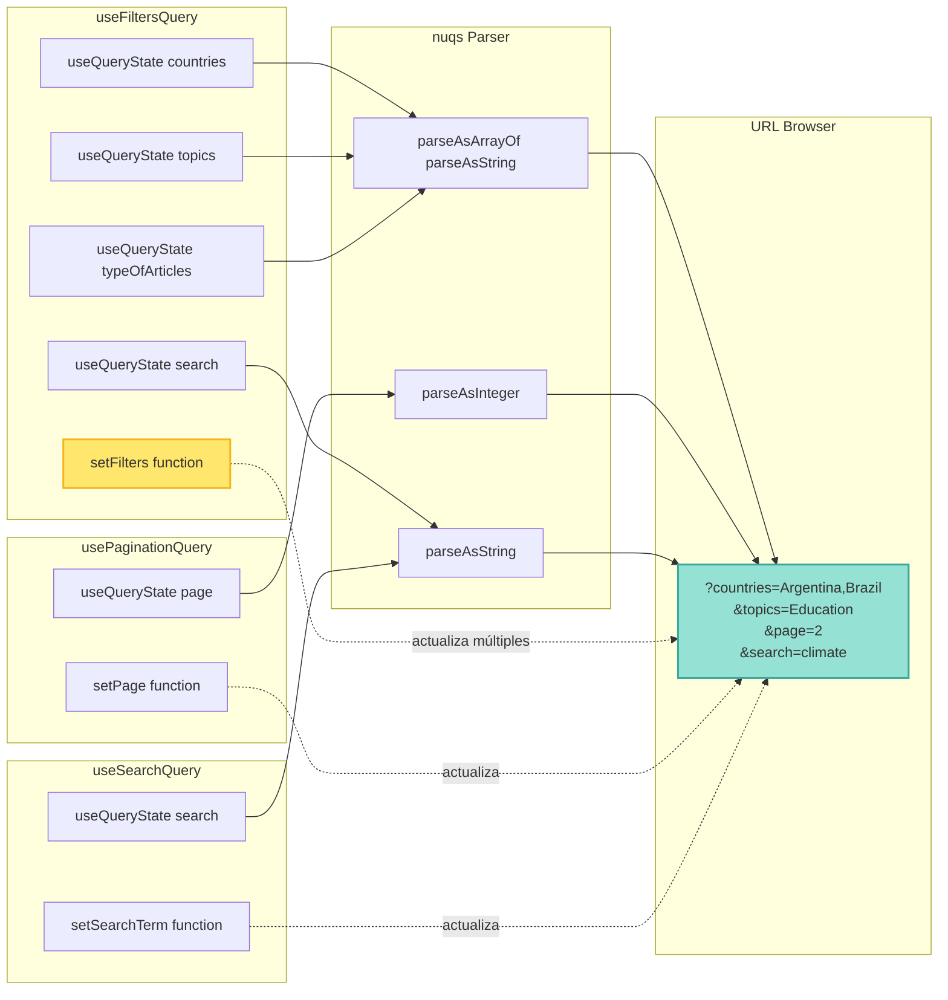

---

## 7. Diagrama de Despliegue

### 7.1 Arquitectura de Deployment

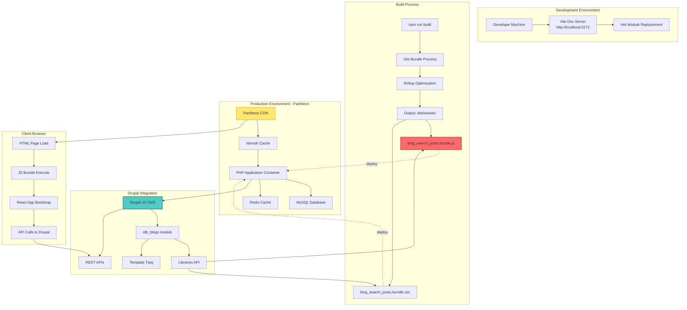

### 7.2 Flujo de Deployment

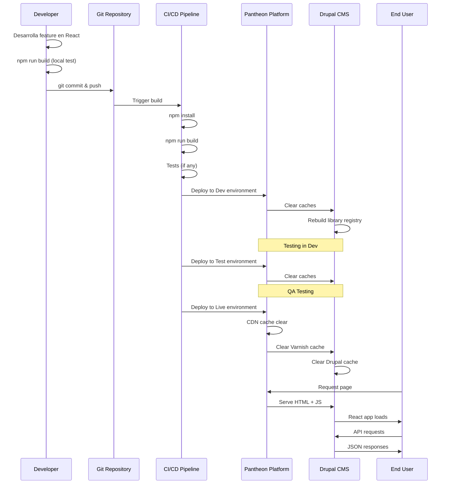

### 7.3 Configuración de Build (Vite)

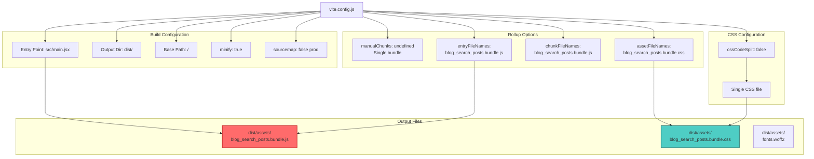

---

## 8. Estructura de Datos

### 8.1 Modelo de Datos: Redux State

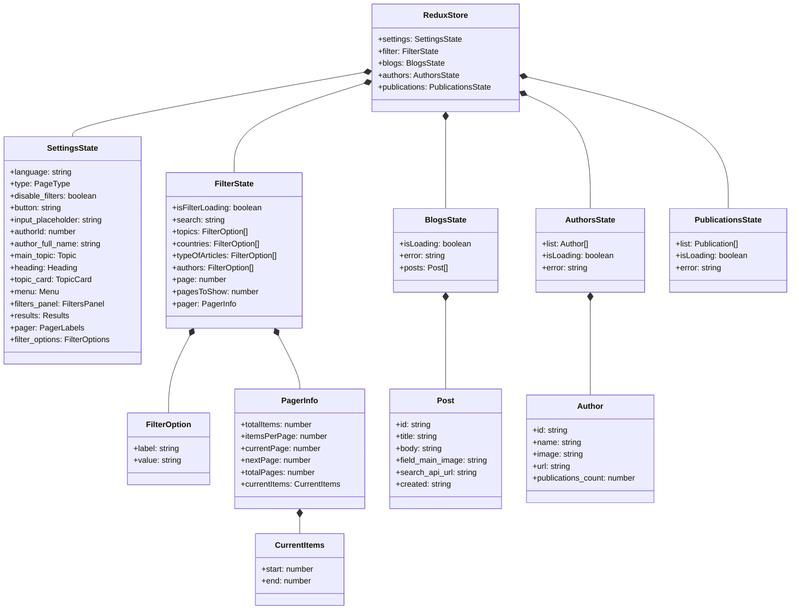

### 8.2 Modelo de Datos: API Response

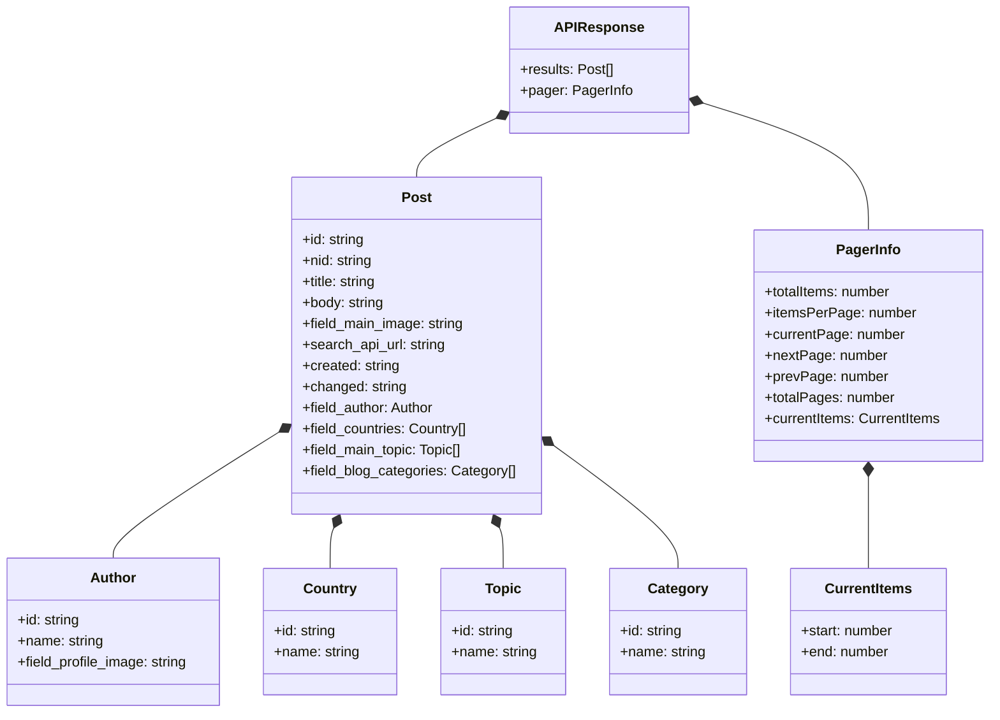

### 8.3 Modelo de Datos: localStorage

```mermaid
erDiagram
    LOCALSTORAGE ||--o{ FILTER_STORAGE : contains
    FILTER_STORAGE {
        object filters
        string language
        string pageType
        number timestamp
    }

    FILTERS ||--|| FILTER_STORAGE : inside
    FILTERS {
        array countries
        array topics
        array typeOfArticles
        string search
        number page
    }

    FILTER_OPTION ||--o{ FILTERS : "in arrays"
    FILTER_OPTION {
        string label
        string value
    }

    SESSION_STORAGE ||--o{ LANGUAGE_FLAG : contains
    LANGUAGE_FLAG {
        string LANGUAGE_CHANGE_FLAG
    }
```

**Ejemplo de estructura en localStorage:**

```javascript
// Key: idb_blog_filters_search_page
{
  "filters": {
    "countries": [
      { "label": "Argentina", "value": "2485" },
      { "label": "Brazil", "value": "2497" }
    ],
    "topics": [
      { "label": "Education", "value": "3090681" }
    ],
    "typeOfArticles": [],
    "search": "",
    "page": 1
  },
  "language": "en",
  "pageType": "search_page",
  "timestamp": 1699123456789
}
```

### 8.4 Transformación de Datos: Labels ↔ Values

```mermaid
graph LR
    subgraph "URL Query Params"
        URL1["?countries=Argentina,Brazil"]
    end

    subgraph "mapLabelsToOptions"
        MAP1["Helper function<br/>Busca en settings.filter_options"]
        MAP2["Encuentra match por label"]
        MAP3["Extrae value correspondiente"]
    end

    subgraph "Redux Format"
        REDUX1["countries: [<br/>  {label: 'Argentina', value: '2485'},<br/>  {label: 'Brazil', value: '2497'}<br/>]"]
    end

    subgraph "remapLabelsByValue"
        REMAP1["Helper function<br/>Busca por value (inmutable)"]
        REMAP2["Obtiene nuevo label del idioma actual"]
        REMAP3["Preserva value original"]
    end

    subgraph "Translated Redux"
        REDUX2["countries: [<br/>  {label: 'Argentina', value: '2485'},<br/>  {label: 'Brasil', value: '2497'}<br/>]"]
    end

    URL1 --> MAP1
    MAP1 --> MAP2
    MAP2 --> MAP3
    MAP3 --> REDUX1

    REDUX1 -.->|cambio de idioma| REMAP1
    REMAP1 --> REMAP2
    REMAP2 --> REMAP3
    REMAP3 --> REDUX2

    style MAP1 fill:#FFE66D,stroke:#F4B41A,stroke-width:2px
    style REMAP1 fill:#FF9800,stroke:#E65100,stroke-width:2px
```

---

## 9. Patrones de Diseño

### 9.1 Patrones Arquitectónicos

#### Container/Presentational Pattern

```mermaid
graph LR
    subgraph "Container Component"
        C1["Posts.jsx<br/>────────<br/>✓ useSelector<br/>✓ useDispatch<br/>✓ useEffect<br/>✓ Business Logic<br/>✓ Data Fetching"]
    end

    subgraph "Presentational Component"
        P1["BlogCards.jsx<br/>────────<br/>✓ Props only<br/>✓ UI Rendering<br/>✓ No Redux<br/>✓ Stateless"]
    end

    subgraph "Redux Store"
        R1["Global State"]
    end

    R1 --> C1
    C1 -->|"data via props"| P1

    style C1 fill:#FF6B6B,stroke:#C92A2A,stroke-width:2px
    style P1 fill:#4ECDC4,stroke:#2C7873,stroke-width:2px
```

**Ejemplo:**
- **Container**: `Posts.jsx` - Conecta Redux, fetch data, maneja loading/error
- **Presentational**: `BlogCards.jsx` - Recibe posts y los renderiza

#### Custom Hooks Pattern

```mermaid
graph TD
    Hook[Custom Hook<br/>useFilterControls]

    subgraph "Encapsula Lógica"
        L1[Estado local]
        L2[Side effects]
        L3[Event handlers]
        L4[Helper functions]
        L5[Redux interactions]
    end

    subgraph "Composición"
        C1[useFiltersQuery]
        C2[usePaginationQuery]
        C3[useLocalStorageFilters]
    end

    subgraph "Retorna"
        R1[Values]
        R2[Functions]
        R3[State]
    end

    Hook --> L1
    Hook --> L2
    Hook --> L3
    Hook --> L4
    Hook --> L5

    Hook --> C1
    Hook --> C2
    Hook --> C3

    Hook --> R1
    Hook --> R2
    Hook --> R3

    style Hook fill:#FFE66D,stroke:#F4B41A,stroke-width:3px
```

**Beneficios:**
- Reutilización de lógica
- Separación de concerns
- Testeable independientemente
- Composición de múltiples hooks

#### Facade Pattern

```mermaid
graph TD
    Component[Component<br/>FilterButtonPanel]

    Facade[useFilterControls<br/>FACADE]

    subgraph "Complejidad Oculta"
        S1[Redux dispatch]
        S2[nuqs setFilters]
        S3[localStorage save]
        S4[API fetch]
        S5[Error handling]
        S6[Data mapping]
    end

    Component -->|"simple API"| Facade
    Facade --> S1
    Facade --> S2
    Facade --> S3
    Facade --> S4
    Facade --> S5
    Facade --> S6

    style Facade fill:#FF6B6B,stroke:#C92A2A,stroke-width:3px
```

**Ejemplo:**
```javascript
// Component solo llama:
applyFilters(filterObject);

// Facade maneja internamente:
// - Mapeo de datos
// - Redux update
// - URL update
// - localStorage save
// - API fetch
// - Error handling
```

#### Factory Pattern

```mermaid
graph TD
    Factory[getBasePath Factory]

    subgraph "Input"
        I1["settings.type<br/>settings.language<br/>settings.main_topic<br/>settings.authorId"]
    end

    subgraph "Decision Logic"
        D1{type?}
        D1 -->|search_page| O1
        D1 -->|topic_page| O2
        D1 -->|single_author_page| O3
        D1 -->|author_list_page| O4
    end

    subgraph "Output"
        O1["/en/api/v1/blogs"]
        O2["/en/api/v1/blogs/education"]
        O3["/en/api/v1/blogs/author/123"]
        O4["/en/api/v1/authors"]
    end

    I1 --> Factory
    Factory --> D1

    style Factory fill:#FFE66D,stroke:#F4B41A,stroke-width:3px
```

#### Strategy Pattern

```mermaid
graph TD
    Context[dispatchByType]

    subgraph "Strategies"
        S1[fetchBlogs Strategy]
        S2[fetchAuthors Strategy]
    end

    Decision{settings.type?}

    Context --> Decision
    Decision -->|author_list_page| S2
    Decision -->|otros| S1

    S1 --> API1[GET /api/v1/blogs]
    S2 --> API2[GET /api/v1/authors]

    style Context fill:#FF6B6B,stroke:#C92A2A,stroke-width:2px
```

#### Observer Pattern

```mermaid
graph LR
    subgraph "Subject (Redux Store)"
        Store[Redux Store State]
    end

    subgraph "Observers (Components)"
        O1[Posts]
        O2[BlogCards]
        O3[Pager]
        O4[FilterApplied]
    end

    Store -.->|"subscribe via useSelector"| O1
    Store -.->|notify on change| O2
    Store -.->|notify on change| O3
    Store -.->|notify on change| O4

    O1 -.->|re-render| UI1[Update UI]
    O2 -.->|re-render| UI2[Update UI]
    O3 -.->|re-render| UI3[Update UI]
    O4 -.->|re-render| UI4[Update UI]

    style Store fill:#4ECDC4,stroke:#2C7873,stroke-width:3px
```

#### Adapter Pattern

```mermaid
graph LR
    subgraph "React World"
        React[React Component]
    end

    subgraph "Adapter"
        Adapter["createComponent<br/>@lit/react<br/>────────<br/>Convierte props<br/>Maneja eventos<br/>Expone API React"]
    end

    subgraph "Lit World"
        Lit[Lit Web Component<br/>Custom Element]
    end

    React -->|"React props"| Adapter
    Adapter -->|"Web Component API"| Lit
    Lit -->|"Custom events"| Adapter
    Adapter -->|"React callbacks"| React

    style Adapter fill:#FFE66D,stroke:#F4B41A,stroke-width:3px
```

### 9.2 Patrones de Optimización

#### Memoization Pattern

```javascript
// En BlogCards.jsx
const blogCards = useMemo(() => (
  <BlogCards posts={blogsState.posts} isLoading={blogsState.isLoading} />
), [blogsState.posts, blogsState.isLoading]);

// Solo re-renderiza cuando posts o isLoading cambian
```

#### Skeleton Loading Pattern

```javascript
// En BlogCards.jsx
const getCardsToRender = () => {
  if (isLoading && posts.length === 0) {
    // Generar 10 items skeleton
    return Array(10).fill(null).map((_, index) => ({
      id: `skeleton-${index}`,
      // ... campos vacíos
    }));
  }
  return posts;
};
```

#### Defensive Programming Pattern

```javascript
// Default parameters
const PostCard = ({ item = {}, isLoading = false }) => {
  // Valores seguros
  const safeItem = {
    field_main_image: item.field_main_image || "",
    title: item.title || "",
    // ...
    ...item
  };

  // Array validation
  const safePosts = Array.isArray(posts) ? posts : [];

  return (/* JSX seguro */);
};
```

---

## 10. Stack Tecnológico

### 10.1 Frontend Stack

```mermaid
graph TB
    subgraph "Core Framework"
        React["React 19.1.1<br/>────────<br/>✓ Hooks API<br/>✓ Concurrent Features<br/>✓ Server Components Ready"]
    end

    subgraph "State Management"
        Redux["Redux Toolkit 2.8.2<br/>────────<br/>✓ Slices<br/>✓ Thunks<br/>✓ RTK Query Ready"]
        Nuqs["nuqs 2.4.3<br/>────────<br/>✓ URL State Sync<br/>✓ Type-safe Parsers<br/>✓ SSR Support"]
    end

    subgraph "UI Components"
        Lit["Lit 3.3.1<br/>────────<br/>✓ Web Components<br/>✓ Shadow DOM<br/>✓ Reactive Properties"]
        LitReact["@lit/react 1.0.8<br/>────────<br/>✓ React Wrapper<br/>✓ Event Mapping<br/>✓ Props Bridge"]
    end

    subgraph "Build Tools"
        Vite["Vite 7.1.5<br/>────────<br/>✓ Fast HMR<br/>✓ ES Modules<br/>✓ Optimized Build"]
    end

    subgraph "HTTP Client"
        Axios["Axios 1.12.2<br/>────────<br/>✓ Promise-based<br/>✓ Interceptors<br/>✓ Request/Response Transform"]
    end

    subgraph "Utilities"
        DOMPurify["DOMPurify 3.2.7<br/>────────<br/>✓ XSS Protection<br/>✓ HTML Sanitization"]
    end

    React --> Redux
    React --> Nuqs
    React --> LitReact
    LitReact --> Lit
    React --> Axios
    React --> DOMPurify
    Vite --> React

    style React fill:#61DAFB,stroke:#20232A,stroke-width:3px
    style Redux fill:#764ABC,stroke:#593D88,stroke-width:2px
    style Lit fill:#00E8FF,stroke:#00A8CC,stroke-width:2px
```

### 10.2 Backend Integration

```mermaid
graph LR
    subgraph "Drupal 10 CMS"
        D1[Content Management]
        D2[Views Module]
        D3[REST API Module]
        D4[JSON:API]
        D5[Custom Module: idb_blogs]
    end

    subgraph "API Endpoints"
        API1["/api/v1/blogs"]
        API2["/api/v1/blogs/{topic}"]
        API3["/api/v1/blogs/author/{id}"]
        API4["/api/v1/authors"]
        API5["/api/v1/publications/author/{id}"]
    end

    subgraph "Response Format"
        R1["JSON<br/>{<br/>  results: [...],<br/>  pager: {...}<br/>}"]
    end

    D1 --> D2
    D2 --> D3
    D3 --> D5
    D5 --> API1
    D5 --> API2
    D5 --> API3
    D5 --> API4
    D5 --> API5

    API1 --> R1
    API2 --> R1
    API3 --> R1

    style D5 fill:#0678BE,stroke:#004A70,stroke-width:2px
    style R1 fill:#FFE66D,stroke:#F4B41A,stroke-width:2px
```

### 10.3 Dependencies Overview

| Dependencia | Versión | Propósito | Crítica |
|-------------|---------|-----------|---------|
| **react** | 19.1.1 | Framework UI principal | ✅ Sí |
| **react-dom** | 19.1.1 | Renderizado en DOM | ✅ Sí |
| **@reduxjs/toolkit** | 2.8.2 | Estado global | ✅ Sí |
| **react-redux** | 9.2.0 | Bindings React-Redux | ✅ Sí |
| **nuqs** | 2.4.3 | URL state sync | ✅ Sí |
| **lit** | 3.3.1 | Web Components | ✅ Sí |
| **@lit/react** | 1.0.8 | Puente Lit↔React | ✅ Sí |
| **axios** | 1.12.2 | HTTP client | ✅ Sí |
| **dompurify** | 3.2.7 | Sanitización HTML | ⚠️ Seguridad |
| **vite** | 7.1.5 | Build tool | 🛠️ Dev |

### 10.4 Build Configuration

**vite.config.js** - Configuración de bundling:

```javascript
export default defineConfig({
  plugins: [react()],
  base: "/",
  build: {
    outDir: "dist",
    emptyOutDir: true,
    rollupOptions: {
      output: {
        manualChunks: undefined, // Single bundle
        entryFileNames: "assets/blog_search_posts.bundle.js",
        chunkFileNames: "assets/blog_search_posts.bundle.js",
        assetFileNames: (assetInfo) => {
          if (assetInfo.name && assetInfo.name.endsWith(".css")) {
            return "assets/blog_search_posts.bundle.css";
          }
          return "assets/[name].[ext]";
        }
      }
    },
    cssCodeSplit: false, // Single CSS file
    minify: "terser",
    sourcemap: false // En producción
  }
});
```

---

## 11. Guía de Desarrollo

### 11.1 Setup Inicial

```bash
# Clonar repositorio
cd /path/to/main_site/project/modules/idb_blogs/js/react_search_blogs

# Instalar dependencias
npm install

# Verificar versión Node (>=22.0.0 <=22.14)
node --version

# Desarrollo local
npm run dev
# Abre: http://localhost:5173

# Build para producción
npm run build
# Output: dist/assets/
```

### 11.2 Estructura de Trabajo

```mermaid
graph TD
    Start[Inicio de Feature]

    Start --> Branch[Crear branch]
    Branch --> Dev[npm run dev]
    Dev --> Code[Escribir código]
    Code --> Test[Probar en browser]
    Test --> Decision{¿Funciona?}

    Decision -->|No| Debug[Debug]
    Debug --> Code

    Decision -->|Sí| Build[npm run build]
    Build --> Integrate[Integrar con Drupal]
    Integrate --> TestDrupal[Probar en Drupal local]
    TestDrupal --> Decision2{¿Funciona?}

    Decision2 -->|No| DebugDrupal[Debug integración]
    DebugDrupal --> Code

    Decision2 -->|Sí| Commit[Git commit]
    Commit --> Push[Git push]
    Push --> PR[Pull Request]
    PR --> Review[Code Review]
    Review --> Merge[Merge a master]
    Merge --> Deploy[Deploy a Pantheon]

    style Build fill:#FFE66D,stroke:#F4B41A,stroke-width:2px
    style Merge fill:#4CAF50,stroke:#2E7D32,stroke-width:2px
```

### 11.3 Agregar Nuevo Filtro

**Pasos detallados:**

```mermaid
graph TD
    A[Necesidad: Nuevo filtro 'Regions']

    A --> B1[1. Actualizar settingsSlice]
    B1 --> B1A["filter_options.sections:<br/>agregar section type 'idb_regions'"]

    B1A --> C1[2. Actualizar filterSlice]
    C1 --> C1A["Initial state:<br/>regions: []"]
    C1 --> C1B["setFilter reducer:<br/>manejar regions"]
    C1 --> C1C["selectQueryString selector:<br/>incluir regions en query"]

    C1C --> D1[3. Actualizar useFilterControls]
    D1 --> D1A["mapLabelsToOptions:<br/>agregar case 'idb_regions'"]
    D1 --> D1B["remapLabelsByValue:<br/>agregar case 'idb_regions'"]
    D1 --> D1C["applyFilters:<br/>incluir regions en mappedFilters"]

    D1C --> E1[4. Actualizar useFiltersQuery]
    E1 --> E1A["const [regions, setRegions] =<br/>useQueryState('regions', ...)"]
    E1 --> E1B["setFilters function:<br/>incluir regions"]

    E1B --> F1[5. Actualizar useLocalStorageFilters]
    F1 --> F1A["saveFilters:<br/>incluir regions en objeto guardado"]

    F1A --> G1[6. Actualizar Web Component]
    G1 --> G1A["sectionsFilter:<br/>agregar sección regions"]
    G1 --> G1B["IdbFilterBar props:<br/>externalSelectedFilters.regions"]

    G1B --> H1[7. Actualizar FilterApplied]
    H1 --> H1A["selectedFilters:<br/>incluir regions"]
    H1 --> H1B["handleFilterRemove:<br/>manejar regions"]

    H1B --> I1[8. Backend: API Drupal]
    I1 --> I1A["Actualizar endpoint<br/>para aceptar param 'regions'"]
    I1 --> I1B["Actualizar View en Drupal<br/>agregar filtro contextual"]

    I1B --> J1[9. Testing]
    J1 --> J1A["Test aplicar filtro"]
    J1 --> J1B["Test cambio de idioma"]
    J1 --> J1C["Test URL directa"]
    J1 --> J1D["Test localStorage"]

    J1D --> End[✅ Feature completo]

    style A fill:#FF6B6B,stroke:#C92A2A,stroke-width:2px
    style End fill:#4CAF50,stroke:#2E7D32,stroke-width:2px
```

### 11.4 Agregar Nuevo Tipo de Página

**Ejemplo: Agregar "publication_page"**

```mermaid
graph TD
    A[Nuevo tipo: publication_page]

    A --> B[1. Crear Layout]
    B --> B1["layouts/publication-layout/<br/>PublicationLayout.jsx"]

    B1 --> C[2. Actualizar App.jsx]
    C --> C1["switch (settings.type) {<br/>  case 'publication_page':<br/>    return <PublicationLayout />;<br/>}"]

    C1 --> D[3. Crear API Endpoint]
    D --> D1["api/paths.js:<br/>getPathPublications(language)"]
    D1 --> D2["getBasePath factory:<br/>agregar case 'publication_page'"]

    D2 --> E[4. Crear Redux Slice (si necesario)]
    E --> E1["slices/publications/<br/>publicationsSlice.jsx"]
    E1 --> E2["Thunks: fetchPublications"]
    E2 --> E3["Reducers: setPublications"]

    E3 --> F[5. Crear Componentes]
    F --> F1["components/publications/<br/>PublicationCard.jsx"]
    F1 --> F2["components/publications/<br/>PublicationList.jsx"]

    F2 --> G[6. Container]
    G --> G1["containers/publications/<br/>Publications.jsx"]

    G1 --> H[7. Backend Drupal]
    H --> H1["Crear View de publicaciones"]
    H1 --> H2["Crear REST endpoint"]
    H2 --> H3["Agregar a idb_blogs.libraries.yml"]

    H3 --> I[8. Testing]
    I --> End[✅ Nuevo tipo listo]

    style A fill:#FF6B6B,stroke:#C92A2A,stroke-width:2px
    style End fill:#4CAF50,stroke:#2E7D32,stroke-width:2px
```

### 11.5 Debugging Guide

#### Redux DevTools

```javascript
// Instalar extensión en browser
// Store ya configurado con:
const store = configureStore({
  reducer: rootReducer,
  devTools: process.env.NODE_ENV !== 'production'
});
```

**Inspeccionar:**
- State tree completo
- Action history
- Time-travel debugging
- State diffs

#### localStorage Debug Component

```javascript
// En desarrollo, renderizar:
import LocalStorageDebug from '@/components/debug/LocalStorageDebug';

<LocalStorageDebug />
```

**Muestra:**
- Estado actual de localStorage
- Botón para limpiar storage
- Timestamp de último guardado

#### Console Logs Estratégicos

```javascript
// useFilterControls.js ya incluye:
console.log("[PRIORITY] Cambio de idioma detectado");
console.log("[PRIORITY] URL directa detectada");
console.log("[PRIORITY] Navegación interna detectada");

// Para debug adicional:
console.log("[DEBUG] Redux state:", store.getState());
console.log("[DEBUG] URL params:", window.location.search);
console.log("[DEBUG] localStorage:", localStorage.getItem('idb_blog_filters_search_page'));
```

#### Network Tab

**Inspeccionar API calls:**
1. Abrir DevTools → Network
2. Filtrar por XHR
3. Ver request URL con query string
4. Ver response payload
5. Ver timing y latencia

### 11.6 Testing Checklist

**Antes de commit:**

- [ ] Build sin errores: `npm run build`
- [ ] No console errors en browser
- [ ] Filtros aplican correctamente
- [ ] Paginación funciona
- [ ] Búsqueda funciona
- [ ] URL se actualiza correctamente
- [ ] localStorage persiste filtros
- [ ] Cambio de idioma funciona
- [ ] Skeleton loading muestra
- [ ] Error states muestran
- [ ] Empty states muestran
- [ ] Responsive design OK
- [ ] Web Components renderizan

**Testing de integración:**

- [ ] Drupal carga el bundle JS/CSS
- [ ] data-default-props parsea correctamente
- [ ] API endpoints responden
- [ ] Links de idioma se actualizan
- [ ] Navegación entre páginas funciona

---

## 12. Recomendaciones y Mejoras

### 12.1 Performance

#### Implementar Code Splitting

```javascript
// App.jsx - Lazy load layouts
const SearchBlogsLayout = lazy(() => import('./layouts/search-blogs-layout/SearchBlogsLayout'));
const TopicBlogsLayout = lazy(() => import('./layouts/topic-blogs-layout/TopicBlogsLayout'));

<Suspense fallback={<LoadingSpinner />}>
  <SearchBlogsLayout />
</Suspense>
```

**Beneficio:** Reducir bundle inicial, cargar solo lo necesario

#### Virtualización de Listas

```javascript
// Para listas largas de autores
import { FixedSizeList } from 'react-window';

<FixedSizeList
  height={600}
  itemCount={authors.length}
  itemSize={120}
>
  {AuthorRow}
</FixedSizeList>
```

**Beneficio:** Renderizar solo items visibles

#### Debounce en Búsqueda

```javascript
// SearchBanner - debounce input
import { debounce } from 'lodash';

const debouncedSearch = useMemo(
  () => debounce((value) => {
    applySearch(value);
  }, 500),
  []
);
```

**Beneficio:** Reducir API calls innecesarias

### 12.2 Mantenibilidad

#### TypeScript Migration

```typescript
// Convertir gradualmente a TypeScript
// Ejemplo: filterSlice.ts
interface FilterState {
  isFilterLoading: boolean;
  search: string;
  topics: FilterOption[];
  // ...
}

interface FilterOption {
  label: string;
  value: string;
}
```

**Beneficio:** Type safety, mejor DX, menos bugs

#### Unit Testing

```javascript
// tests/hooks/useFilterControls.test.js
import { renderHook } from '@testing-library/react-hooks';
import { useFilterControls } from '@/hooks/useFilterControls';

test('applyFilters actualiza Redux y URL', () => {
  const { result } = renderHook(() => useFilterControls());
  // ...
});
```

**Beneficio:** Confianza en refactors, documentación viva

#### PropTypes o Zod Validation

```javascript
// PostCard.jsx
import PropTypes from 'prop-types';

PostCard.propTypes = {
  item: PropTypes.shape({
    id: PropTypes.string.isRequired,
    title: PropTypes.string.isRequired,
    // ...
  }).isRequired,
  isLoading: PropTypes.bool
};
```

**Beneficio:** Validación en runtime, documentación

### 12.3 UX Improvements

#### Loading State Mejorado

```javascript
// Mostrar toast notification en vez de solo skeleton
import { toast } from 'react-hot-toast';

const fetchBlogs = () => async (dispatch) => {
  const toastId = toast.loading('Cargando posts...');
  try {
    // ...
    toast.success('Posts cargados', { id: toastId });
  } catch (error) {
    toast.error('Error al cargar', { id: toastId });
  }
};
```

#### Infinite Scroll

```javascript
// Reemplazar paginación tradicional con infinite scroll
import { useInView } from 'react-intersection-observer';

const { ref, inView } = useInView();

useEffect(() => {
  if (inView && hasMore) {
    dispatch(fetchMoreBlogs());
  }
}, [inView]);
```

#### Filtros como Chips

```javascript
// Mostrar filtros activos como chips removibles inline
<div className="active-filters">
  {filters.countries.map(country => (
    <Chip
      key={country.value}
      label={country.label}
      onRemove={() => removeFilter('countries', country.value)}
    />
  ))}
</div>
```

### 12.4 Seguridad

#### Content Security Policy

```html
<!-- index.html -->
<meta http-equiv="Content-Security-Policy"
      content="default-src 'self'; script-src 'self' 'unsafe-inline';">
```

#### Sanitización Mejorada

```javascript
// Configurar DOMPurify más estricto
const sanitize = (html) => DOMPurify.sanitize(html, {
  ALLOWED_TAGS: ['p', 'br', 'strong', 'em', 'a'],
  ALLOWED_ATTR: ['href', 'target']
});
```

#### Rate Limiting en API Calls

```javascript
// Implementar rate limiting client-side
import pThrottle from 'p-throttle';

const throttledFetch = pThrottle({
  limit: 10,
  interval: 1000
})(fetchBlogs);
```

### 12.5 Arquitectura

#### Service Layer

```javascript
// services/blogService.js - Encapsular lógica de negocio
export class BlogService {
  static async fetchBlogs(filters) {
    const queryString = this.buildQueryString(filters);
    const response = await apiClient.get(`/blogs?${queryString}`);
    return this.transformResponse(response.data);
  }

  static buildQueryString(filters) { /* ... */ }
  static transformResponse(data) { /* ... */ }
}

// En thunk:
const fetchBlogs = () => async (dispatch) => {
  const data = await BlogService.fetchBlogs(filters);
  dispatch(setBlogs(data));
};
```

**Beneficio:** Separación clara, testeable, reutilizable

#### Error Boundary

```javascript
// components/ErrorBoundary.jsx
class ErrorBoundary extends React.Component {
  state = { hasError: false };

  static getDerivedStateFromError(error) {
    return { hasError: true };
  }

  componentDidCatch(error, errorInfo) {
    console.error('Error:', error, errorInfo);
    // Send to error tracking service
  }

  render() {
    if (this.state.hasError) {
      return <ErrorFallback />;
    }
    return this.props.children;
  }
}

// En App.jsx:
<ErrorBoundary>
  <App />
</ErrorBoundary>
```

#### Feature Flags

```javascript
// Controlar features desde settings
const settings = {
  // ...
  features: {
    infiniteScroll: false,
    advancedFilters: true,
    darkMode: false
  }
};

// En componentes:
{settings.features.infiniteScroll && <InfiniteScroll />}
```

### 12.6 Monitoreo

#### Analytics Integration

```javascript
// utils/analytics.js
export const trackFilterApply = (filters) => {
  window.gtag('event', 'filter_apply', {
    countries: filters.countries.length,
    topics: filters.topics.length
  });
};

// En useFilterControls:
const applyFilters = (data) => {
  // ...
  trackFilterApply(mappedFilters);
};
```

#### Error Tracking

```javascript
// Integrar Sentry o similar
import * as Sentry from "@sentry/react";

Sentry.init({
  dsn: "YOUR_DSN",
  integrations: [new Sentry.BrowserTracing()],
  tracesSampleRate: 1.0,
});

// Wrapper en main.jsx:
<Sentry.ErrorBoundary fallback={<ErrorFallback />}>
  <App />
</Sentry.ErrorBoundary>
```

### 12.7 Accessibility

#### ARIA Labels

```javascript
// Mejorar accesibilidad en filtros
<IdbFilterBar
  role="search"
  aria-label="Filtros de búsqueda de blogs"
  aria-live="polite"
/>
```

#### Keyboard Navigation

```javascript
// Asegurar que todos los controles son accesibles por teclado
<button
  onClick={handleReset}
  onKeyPress={(e) => e.key === 'Enter' && handleReset()}
  aria-label="Limpiar todos los filtros"
>
  Reset
</button>
```

#### Skip Links

```javascript
// Agregar skip navigation
<a href="#main-content" className="skip-link">
  Skip to main content
</a>
<main id="main-content">
  {/* contenido */}
</main>
```

---

## 13. Glosario

| Término | Definición |
|---------|------------|
| **RTK** | Redux Toolkit - librería oficial de Redux para configuración simplificada |
| **nuqs** | Next.js URL Query State - librería para sincronizar estado con URL |
| **Lit** | Framework para crear Web Components estándar |
| **Thunk** | Función asíncrona en Redux para side effects |
| **Slice** | Porción del estado Redux con reducers y actions |
| **Selector** | Función para extraer/derivar datos del estado Redux |
| **Hydration** | Proceso de poblar el estado inicial desde una fuente externa |
| **Skeleton Loading** | UI placeholder que muestra la estructura mientras carga |
| **Shadow DOM** | Árbol DOM encapsulado dentro de un Web Component |
| **Facade** | Patrón que provee interfaz simplificada a un subsistema complejo |
| **Factory** | Patrón que crea objetos sin especificar la clase exacta |
| **Container** | Componente conectado a estado global, maneja lógica |
| **Presentational** | Componente que solo recibe props y renderiza UI |

---

## 14. Referencias y Links

### Documentación Oficial

- **React 19**: https://react.dev/
- **Redux Toolkit**: https://redux-toolkit.js.org/
- **nuqs**: https://nuqs.47ng.com/
- **Lit**: https://lit.dev/
- **Vite**: https://vitejs.dev/
- **Axios**: https://axios-http.com/

### Documentación Interna

- [DOCUMENTATION.md](./DOCUMENTATION.md) - Documentación técnica detallada
- [LOCALSTORAGE_IMPLEMENTATION.md](./LOCALSTORAGE_IMPLEMENTATION.md) - Implementación de localStorage
- [LANGUAGE_CHANGE_FLOW.md](./LANGUAGE_CHANGE_FLOW.md) - Flujo de cambio de idioma
- [PRIORITY_LOGIC_FINAL.md](./PRIORITY_LOGIC_FINAL.md) - Lógica de prioridades
- [LANGUAGE_LINKS_SYNC.md](./LANGUAGE_LINKS_SYNC.md) - Sincronización de links

### Archivos Clave

| Archivo | Descripción | Líneas Clave |
|---------|-------------|--------------|
| `src/hooks/useFilterControls.js` | Hook central de coordinación | 45-95 (Sistema de prioridad) |
| `src/slices/filters/filterSlice.jsx` | Estado de filtros | Toda la estructura |
| `src/api/paths.js` | Factory de endpoints | getBasePath() |
| `src/routes/App.jsx` | Router principal | renderLayout() |
| `src/main.jsx` | Punto de entrada | Bootstrap inicial |
| `vite.config.js` | Configuración de build | rollupOptions |

---

## 15. Changelog

| Versión | Fecha | Cambios |
|---------|-------|---------|
| 2.0 | 2025-01-10 | Documentación completa CLAUDE.md creada con diagramas Mermaid |
| 1.0 | 2024-12 | Sistema inicial implementado |

---

## 16. Contacto y Soporte

Para dudas, mejoras o bugs relacionados con este sistema:

1. **Revisar esta documentación primero**
2. **Revisar documentación técnica**: [DOCUMENTATION.md](./DOCUMENTATION.md)
3. **Consultar código fuente** con referencias a esta guía
4. **Para nuevas features**: Seguir [Guía de Desarrollo](#guía-de-desarrollo)

---

**Fin de CLAUDE.md**

*Este documento sirve como memoria completa del sistema React Search Blogs para asistencia de IA y desarrollo humano.*
