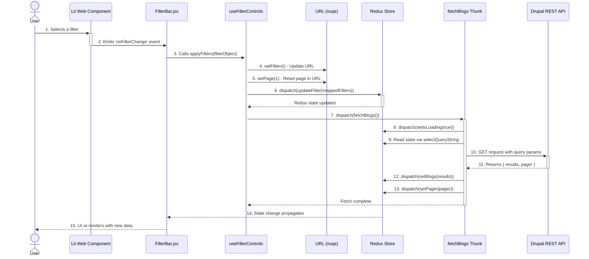

# Technical Documentation: React Search Blogs

## 1. Getting Started

This section provides instructions on how to set up and run the project on a local development environment.

### Prerequisites

Make sure you have Node.js and npm installed on your machine. The project specifies a Node.js version in the `package.json` file.

### Installation

1.  Navigate to the project directory:
    ```bash
    cd project/modules/idb_blogs/js/react_search_blogs
    ```

2.  Install the required dependencies using npm:
    ```bash
    npm install
    ```

### Running the Development Server

To start the Vite development server and run the application locally, use the following command:

```bash
npm run dev
```

This will start a hot-reloading development server, typically available at a local URL like `http://localhost:5173`. The application will automatically reload as you make changes to the source code.

## 2. Introduction

This document provides a comprehensive technical overview of the **React Search Blogs** project. It is intended for developers to quickly understand the project's architecture, data flow, state management strategy, and integration patterns.

The project is a highly interactive search and filtering interface for blog posts. It is built with React and Redux Toolkit and is designed to integrate seamlessly with a Drupal backend and Lit-based Web Components. Its core purpose is to provide a fast, modern, and stateful user experience, allowing users to filter, search, and paginate through blog posts without page reloads.

## 3. Core Architecture: Dual State Management (URL + Redux)

The application employs a dual state management strategy where both the **URL** and **Redux** maintain synchronized state, with explicit coordination between them.

-   **URL State (via `nuqs`):** The URL query parameters store filter values as simple strings/arrays (e.g., `?topics=Education&page=2`). The `nuqs` library provides React hooks (`useFiltersQuery`, `usePaginationQuery`) to read from and write to these URL parameters.
-   **Redux State (In-Memory):** The Redux store holds the complete application state, including filter objects with both `label` and `value` properties, blog posts, loading states, and pagination metadata. React components subscribe to Redux to render the UI.
-   **Initial Load (URL → Redux):** On page load, if URL parameters exist, the `useFilterControls` hook reads them, converts label strings to full filter objects (with `label` and `value`), and dispatches `updateFilter` to populate Redux.
-   **User Interaction (URL + Redux):** When a user applies filters, the application performs three sequential actions:
    1. Updates the URL via `nuqs` setters (`setFilters`, `setPage`)
    2. Updates Redux via `dispatch(updateFilter(...))`
    3. Triggers data fetch via `dispatch(fetchBlogs())` or `dispatch(fetchAuthors())`

This architecture provides several key benefits:
-   **Shareable & Bookmarkable URLs:** Users can copy, paste, and bookmark URLs with their specific search criteria applied.
-   **Browser History:** The browser's back and forward buttons work as expected, navigating through the user's search history.
-   **Resilient State:** Reloading the page preserves the complete application state.

 ```mermaid
graph TD
    subgraph Browser
        User[User] --> LitWC["Lit Web Components\n(e.g., idb-filter-bar)"]
        URL["URL Query String\n(via nuqs)"]
    end

    subgraph React_Application["React Application"]
        ReactWrapper["React Wrapper Components\n(FilterBar.jsx)"]
        Hook["useFilterControls Hook\n(Coordination Logic)"]
        ReduxStore["Redux Toolkit Store\n(Complete State)"]
        Thunks["Async Thunks\n(fetchBlogs, updateFilter)"]
        APIClient["API Client\n(axios)"]
    end

    subgraph Backend
        Drupal["Drupal Backend"]
        APIEndpoint["REST API Endpoint"]
    end

    User -- Interacts with --> LitWC
    LitWC -- DOM Event --> ReactWrapper
    ReactWrapper -- Calls handler --> Hook

    Hook -- 1. Updates URL --> URL
    Hook -- 2. Dispatches updateFilter --> ReduxStore
    Hook -- 3. Dispatches fetchBlogs --> Thunks

    Thunks -- Reads state via selector --> ReduxStore
    Thunks -- HTTP Request --> APIClient
    APIClient -- Calls --> APIEndpoint
    APIEndpoint -- Returns data --> APIClient
    APIClient -- Resolves --> Thunks
    Thunks -- Dispatches setBlogs --> ReduxStore

    ReactWrapper -- Subscribes to --> ReduxStore
    URL -- On initial load --> Hook
    Hook -- Converts & dispatches --> ReduxStore

    classDef browser fill:#e3f2fd,stroke:#333;
    classDef react fill:#e8f5e9,stroke:#333;
    classDef backend fill:#fbe9e7,stroke:#333;
    class User,LitWC,URL browser;
    class ReactWrapper,Hook,ReduxStore,Thunks,APIClient react;
    class Drupal,APIEndpoint backend;
```

## 4. Data Flow

The data flow follows a unidirectional pattern, initiated by either a page load or a user interaction.

**Scenario: User Applies a Filter**



1.  **Initial Load (URL → Redux):** On component mount, the `useFilterControls` hook checks if Redux has initial state and the URL has query parameters. If so, it converts URL filter labels to full filter objects (with `label` and `value` properties) by matching them against the `settings.filter_options` configuration, then dispatches `updateFilter` to populate Redux.
2.  **User Interaction:** A user selects a filter in the `<idb-filter-bar>` Lit Web Component.
3.  **Event Emission:** The Web Component emits a DOM event (`onFilterChange`) with the selected filter data.
4.  **Event Handler (`FilterBar.jsx`):** The `FilterBar` component receives the event and calls the `applyFilters` function from the `useFilterControls` hook.
5.  **Coordinated State Update (`useFilterControls`):** The `applyFilters` function performs three sequential operations:
    - **Step 1:** Calls `setFilters()` and `setPage(1)` from the `nuqs` hooks to update the URL query string.
    - **Step 2:** Dispatches `updateFilter(mappedFilters)` to update the Redux store with the new filter state.
    - **Step 3:** Calls `dispatchByType()` which dispatches either `fetchBlogs()` or `fetchAuthors()` depending on the page type.
6.  **API Call (`fetchBlogs` thunk):** The thunk sets `isLoading` to `true`, uses the `selectQueryString` selector to read the current Redux state and build query parameters, makes an HTTP request to the Drupal REST API, and updates Redux with the returned data.
7.  **State Update (Redux):**
    -   `isLoading` is set to `true`.
    -   When the API call completes, the `setBlogs` and `setPager` reducers update the Redux store with the new posts and pagination information. `isLoading` is set to `false`.
8.  **UI Re-render:** Components subscribed to the Redux store (like `Posts.jsx` and `Pager.jsx`) automatically re-render with the new data, showing the filtered results to the user.

## 5. Folder Structure

The `src` directory is organized by feature and responsibility to promote modularity and maintainability.

```
src/
├── api/              # Axios instance and API call functions.
├── components/       # Reusable, presentational React components.
│   ├── posts/        # Components related to displaying posts (BlogCards, PostCard).
│   └── filters/      # Components for filtering (FilterBar, FilterApplied).
├── containers/       # "Smart" components connected to the Redux store.
│   └── posts/        # The main container for displaying posts and handling effects.
├── helpers/          # Utility functions and Lit component wrappers.
├── hooks/            # Custom React hooks for shared logic.
├── layouts/          # Components that define the page structure (e.g., SearchBlogsLayout).
├── main.jsx          # The main entry point of the application.
├── reducers/         # Redux store configuration and root reducer.
├── routes/           # The main App component and routing logic.
└── slices/           # Redux Toolkit slice definitions.
    ├── blogs/        # State for posts, loading, and errors.
    ├── filters/      # State for all filter criteria and pagination.
    └── settings/     # State for initial application configuration.
```

## 6. Key Components & Hooks

### `main.jsx`
-   Initializes the Redux store.
-   Dispatches `initializeAppSettings` to load configuration from the DOM.
-   Wraps the `App` component with the Redux `<Provider>` and `nuqs` context.
-   Renders the application into the DOM element `#idb-search-blogs`.

### `routes/App.jsx`
-   The root component of the application.
-   Reads the `settings.type` from the Redux store to dynamically render the correct layout (e.g., `SearchBlogsLayout`, `TopicBlogsLayout`). This allows the same React application to serve different page types.

### Hooks (`/hooks`)
-   **`useFiltersQuery.jsx`**: Manages the state of `countries`, `topics`, `typeOfArticles`, and `search` in the URL query string using `nuqs`. Returns both the current URL filter values and setter functions (`setFilters`, `setCountries`, `setTopics`, etc.).
-   **`usePaginationQuery.jsx`**: Manages the `page` number in the URL query string using `nuqs`. Returns `page` and `setPage`.
-   **`useFilterControls.js`**: The central coordination hook that orchestrates the entire filter workflow. It combines URL state (via `nuqs` hooks), Redux state, and event handlers. Provides functions like `applyFilters`, `handleReset`, and `applySearch` that are used by filter components.

### `components/filters/FilterBar.jsx`
-   Wraps the Lit Web Component `<idb-filter-bar>`.
-   Uses the `useFilterControls` hook to get filter state, settings, and event handlers.
-   Passes `applyFilters`, `handleReset`, and `applySearch` handlers to the Lit component via props.
-   Renders the search input and optional author button based on the page type.

### `components/filters/filter-button-panel/FilterButtonPanel.jsx`
-   A simplified version of `FilterBar.jsx` used in different layouts.
-   Also uses the `useFilterControls` hook and wraps `<idb-filter-bar>`.
-   Provides the same filtering functionality but with a different UI configuration (e.g., no search input slot).

### `containers/posts/posts.jsx`
-   The main container for displaying blog content, connected to the `blogs` and `settings` slices of the Redux store.
-   Triggers an initial data fetch by dispatching `fetchBlogs` in a `useEffect` hook on component mount.
-   Handles three key UI states:
    -   **Error State:** If `blogsState.error` is truthy, it renders an `<IdbPanelAlert>` with a warning message configured in the `settings` slice.
    -   **Empty State:** If the API call succeeds but returns no posts, it renders an `<IdbPanelAlert>` with an informational message.
    -   **Content State:** Renders the list of posts using the `<BlogCards>` component.
-   Memoizes the `blogCards` element using `useMemo` to prevent re-rendering the list if the `posts` and `isLoading` props haven't changed.

### `components/posts/BlogCards.jsx` & `PostCard.jsx`
-   `BlogCards.jsx` is responsible for rendering the list of post cards.
-   It implements the **skeleton loading** pattern. If `isLoading` is `true` and there are no posts, it generates a temporary array of 10 items and renders a `PostCard` for each, passing the `isLoading` prop down.
-   `PostCard.jsx` is a presentational component that wraps the `<idb-post-card>` Lit web component. It passes props like `is-loading`, `title`, and `image-url` to the underlying web component, ensuring it displays correctly in both loading and loaded states.

### Redux Slices (`/slices`)
-   **`filterSlice.jsx`**:
    -   Holds the state for all search criteria: `search`, `topics`, `countries`, `typeOfArticles`, `page`, and `pager` metadata.
    -   Filter values are stored as objects with `{ label, value }` structure.
    -   `syncFiltersFromURL`: A reducer that updates filter state from URL parameters (used only on initial load).
    -   `setFilter`: A reducer that updates the filter state with new values.
    -   `setPager`: A reducer that updates pagination metadata from API responses.
    -   `selectQueryString`: A selector that builds the API query string by extracting `value` properties from filter objects and formatting them for the Drupal REST API.
-   **`filterSlice` thunks (`thunks.jsx`)**:
    -   `updateFilter`: An async thunk that dispatches `setFilter` to update the Redux state.
-   **`blogsSlice.jsx`**:
    -   Manages the `posts` array, a global `isLoading` flag, and any API `error` messages.
    -   `setBlogs`: Sets the posts array and clears loading/error states.
    -   `setIsLoading`: Updates the loading state.
    -   `setError`: Sets an error message and clears posts.
-   **`blogsSlice` thunks (`thunks.jsx`)**:
    -   `fetchBlogs`: Fetches blog posts from the Drupal REST API using the current Redux filter state.
-   **`settingsSlice.jsx`**:
    -   Stores the initial configuration passed from Drupal via the `data-default-props` attribute.
    -   Includes available filter options, UI labels, page type, and other configuration.

## 7. Lit Web Component Integration

A core architectural feature of this project is the seamless integration of Lit-based Web Components into the React application. This is primarily handled by the `src/helpers/litComponents.jsx` file.

-   **`@lit/react` Wrapper:** It uses the `createComponent` utility from the official `@lit/react` library to create React-compatible wrappers for custom elements.
-   **`LitToReactComponent` Factory:** A custom factory function, `LitToReactComponent`, is used to generate these wrappers. It takes a tag name (e.g., `"idb-post-card"`) and an optional events map.
-   **Dynamic Import & Registration:** The helper first imports all necessary Lit components to ensure their custom elements are registered with the browser via `customElements.define()`.
-   **Exported React Components:** Each wrapped component is then exported as a standard React component (e.g., `IdbPostCard`), which can be imported and used throughout the application with JSX syntax, props, and event handlers.

This pattern provides a robust and maintainable bridge between the two technologies, allowing developers to use feature-rich Web Components as if they were native React components.

## 8. Build and Drupal Integration

### Build Process
The project uses **Vite** for development and building. To create a production build, run:
```bash
npm run build
```
This command compiles the React application and outputs optimized, minified JS and CSS files into the `dist/assets/` directory.

### Drupal Integration
The compiled assets are integrated into Drupal via the module's library definition.

1.  **Library Definition (`idb_blogs.libraries.yml`):** The generated JS and CSS bundles are defined as a Drupal library. This tells Drupal how to load the application's assets.

    ```yaml
    idb_react_search_blogs:
      css:
        base:
          js/react_search_blogs/dist/assets/blog_search_posts.bundle.css: { preprocess: false, minified: true }
      js:
        js/react_search_blogs/dist/assets/blog_search_posts.bundle.js: { preprocess: false, minified: true }
      dependencies:
        - core/drupalSettings
    ```

2.  **Twig Template:** The application is mounted onto a specific `div` in a Twig template. Initial properties (like filter options and layout type) are passed from Drupal to the React app via a `data-default-props` attribute on this element.

    ```twig
    <div id="idb-search-blogs" data-default-props="{{- props|json_encode -}}"></div>
    ```

3.  **Initialization (`settingsSlice.jsx`):** The `initializeAppSettings` thunk (in `src/slices/settings/thunks.jsx`) reads the `data-default-props` attribute from the DOM, parses it, and dispatches the `initializeSettings` action to populate the `settings` slice in the Redux store. This bootstraps the application with its required configuration.
